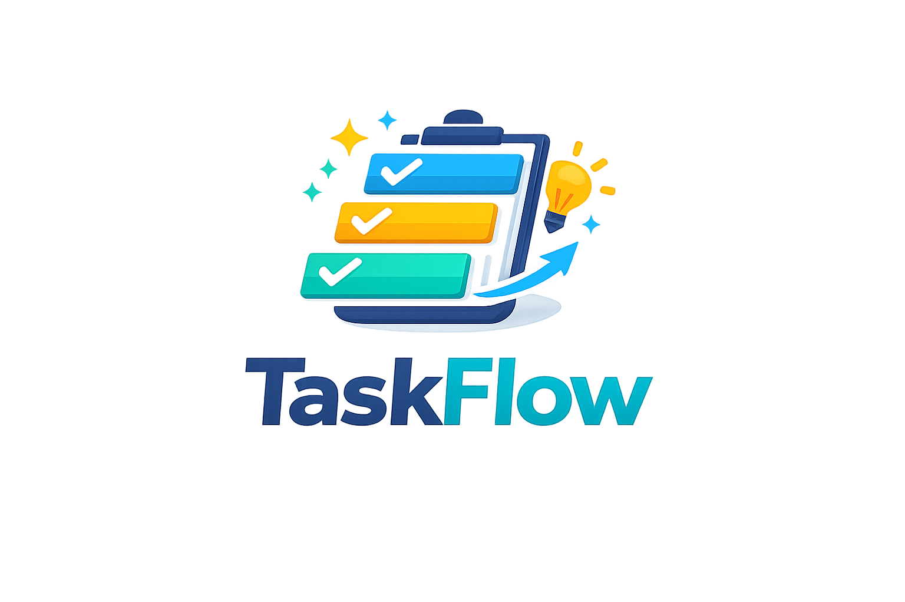

<p align="center">
  
</p>

<p align="center">
  <strong>Projekt- & Aufgabenverwaltung</strong><br>
  Moderne Projektmanagement-App mit PHP-Backend und JSON-Datenspeicherung.
</p>

---

> **[Deutsch](#deutsch)** | **[English](#english)**

---

<a id="deutsch"></a>

## Funktionen

- Benutzer-Login & Registrierung
- Projekte erstellen und verwalten mit Farbmarkierung
- To-Do-Listen mit Kategorien, Prioritäten und Fälligkeitsdaten
- Kanban Board mit Drag & Drop (Standardansicht) — Karten anklicken zum Bearbeiten
- Drag & Drop Sortierung in der Listenansicht
- Globale Suche über Projekte und Aufgaben
- Dunkelmodus (erkennt System-Einstellung automatisch)
- 6 verschiedene Farbthemen mit benutzerspezifischen Einstellungen
- Aktivitäts-Log im Dashboard
- Archiv-Funktion für erledigte Aufgaben
- Export/Import als JSON
- In-App Update-System (git pull)
- Dynamische Animationen & sanfte Übergänge
- Mehrsprachig (DE/EN)
- Setup-Assistent für einfache Erstinstallation
- Benutzerrollen (Admin/User) und Projekt-Berechtigungen
- Projekt-Mitgliederverwaltung (Eigentümer/Bearbeiter/Betrachter) mit Schnellzugriff auf Projektkacheln
- Toast-Benachrichtigungen (ersetzt Browser-Dialoge)
- Benachrichtigungssystem (z.B. bei Projektzuweisung)
- Soft-Delete mit 30-Tage-Papierkorb & Wiederherstellung
- Eigene Bestätigungsdialoge (keine Browser-Popups)
- Automatisches Daten-Migrationssystem für nahtlose Updates
- Docker-Unterstützung für einfaches Deployment

## Voraussetzungen

- PHP 7.4 oder höher
- Webserver (Apache, Nginx oder PHP Built-in Server)
- Schreibrechte für das `/data` Verzeichnis

## Installation

### Option 1: Docker (Empfohlen)

```bash
git clone https://github.com/floppy007/taskflow.git
cd taskflow
```

Die `docker-compose.yml` anpassen (Admin-Passwort ändern!):

```yaml
services:
  taskflow:
    image: floppy001/taskflow:latest
    container_name: taskflow
    ports:
      - "8080:80"
    volumes:
      - taskflow-data:/var/www/html/data
    environment:
      - TZ=Europe/Berlin
      # Admin-Account (wird nur beim ersten Start erstellt)
      - TASKFLOW_ADMIN_USER=admin
      - TASKFLOW_ADMIN_PASS=dein-sicheres-passwort
      - TASKFLOW_ADMIN_NAME=Administrator
    restart: unless-stopped

volumes:
  taskflow-data:
```

```bash
docker compose up -d
```

`http://localhost:8080` öffnen und einloggen. Der Admin-Account wird beim ersten Start automatisch erstellt.

### Option 1b: Unraid

1. In der Unraid-Oberfläche unter **Docker → Template Repositories** folgende URL hinzufügen:
   ```
   https://github.com/floppy007/taskflow
   ```
2. Unter **Docker → Add Container** das Template **TaskFlow** auswählen.
3. Admin-Zugangsdaten und Zeitzone anpassen, dann auf **Apply** klicken.

> Das Admin-Passwort wird nur beim ersten Start verwendet. Danach kann es in der App geändert werden.

### Option 2: Installer

1. [`install.php`](https://raw.githubusercontent.com/floppy007/taskflow/main/install.php) herunterladen und auf den Webserver kopieren (z.B. `/var/www/html/taskflow/`).
2. `http://localhost/taskflow/install.php` im Browser öffnen.
3. Auf **"Download & Install TaskFlow"** klicken — der Installer lädt alle Dateien von GitHub herunter.
4. Admin-Zugangsdaten eingeben und auf **"Create Account & Finish"** klicken.

> Der Installer **löscht sich automatisch** nach erfolgreicher Einrichtung.

### Option 3: Manuell

```bash
git clone https://github.com/floppy007/taskflow.git /var/www/html/taskflow
chmod 755 /var/www/html/taskflow/data
```

Dann `http://localhost/taskflow` öffnen und den Setup-Assistenten durchlaufen.

## Dateistruktur

```
taskflow/
├── install.php        # Setup-Assistent (löscht sich nach Installation)
├── index.php          # Hauptanwendung (HTML/CSS)
├── app.js             # Frontend-Logik (JavaScript)
├── api.php            # Backend-API
├── version.json       # Versionsinformation für Update-System
├── logo.png           # Anwendungslogo
├── Dockerfile         # Docker-Image-Definition
├── docker-compose.yml # Docker Compose Konfiguration
├── docker-entrypoint.sh # Auto-Setup beim ersten Start
├── unraid-template/
│   └── taskflow.xml   # Unraid Docker-Template
├── lang/
│   ├── de.json        # Deutsche Übersetzungen
│   └── en.json        # Englische Übersetzungen
├── data/              # JSON-Datenspeicher (wird vom Installer erstellt)
│   ├── .htaccess      # Zugriffsschutz
│   ├── users.json     # Benutzerdaten
│   ├── projects.json  # Projekte & Aufgaben
│   └── activity.json  # Aktivitätsprotokoll
├── LICENSE            # MIT-Lizenz mit Namensnennung
└── README.md
```

## Sicherheit

**WICHTIG:** Für den Produktiv-Einsatz:

1. **HTTPS verwenden:** Niemals über HTTP in Produktion betreiben!

2. **data-Ordner schützen:** Der Installer erstellt automatisch eine `.htaccess` im `/data`-Ordner. Prüfe, ob sie vorhanden ist:
   ```apache
   Order deny,allow
   Deny from all
   ```

3. **Installer gelöscht?** Nach der Installation sicherstellen, dass `install.php` nicht mehr existiert. Falls doch, manuell löschen.

4. **Session-Sicherheit:** In `api.php` die Session-Einstellungen anpassen:
   ```php
   session_set_cookie_params([
       'secure' => true,
       'httponly' => true,
       'samesite' => 'Strict'
   ]);
   ```

## Updates

### Standard (Webserver)

Unter **Einstellungen > Updates** auf "Update prüfen" klicken. Falls eine neue Version verfügbar ist, kann sie direkt per "Update installieren" von GitHub geladen werden.

Benutzerdaten (`data/users.json`, `data/projects.json`) werden bei Updates nicht überschrieben.

### Docker

```bash
cd taskflow
git pull
docker compose build
docker compose up -d
```

Daten bleiben im Docker Volume erhalten.

## Lizenz

Siehe [LICENSE](LICENSE) für Details. Frei nutzbar, veränderbar und verteilbar — der Copyright-Footer in der App muss erhalten bleiben.

---

<a id="english"></a>

## English

### Features

- User login & registration
- Create and manage projects with color coding
- To-do lists with categories, priorities, and due dates
- Kanban board with drag & drop (default view) — click cards to edit
- Drag & drop task reordering in list view
- Global search across projects and tasks
- Dark mode (auto-detects system preference)
- 6 color themes with per-user preferences
- Activity log on dashboard
- Archive function for completed tasks
- Export/Import as JSON
- In-app update system (git pull)
- Dynamic animations & smooth transitions
- Multi-language support (DE/EN)
- Setup wizard for easy first-time installation
- User roles (Admin/User) and project permissions
- Project member management (Owner/Editor/Viewer) with quick access from project cards
- Toast notifications (replaces browser dialogs)
- Notification system (e.g. when added to a project)
- Soft-delete with 30-day trash & restore
- Custom confirm dialogs (no browser popups)
- Automatic data migration system for seamless updates
- Docker support for easy deployment

### Requirements

- PHP 7.4 or higher
- Web server (Apache, Nginx, or PHP built-in server)
- Write permissions for the `/data` directory

### Installation

#### Option 1: Docker (Recommended)

```bash
git clone https://github.com/floppy007/taskflow.git
cd taskflow
```

Edit `docker-compose.yml` (change the admin password!):

```yaml
services:
  taskflow:
    image: floppy001/taskflow:latest
    container_name: taskflow
    ports:
      - "8080:80"
    volumes:
      - taskflow-data:/var/www/html/data
    environment:
      - TZ=Europe/Berlin
      # Admin account (only created on first start)
      - TASKFLOW_ADMIN_USER=admin
      - TASKFLOW_ADMIN_PASS=your-secure-password
      - TASKFLOW_ADMIN_NAME=Administrator
    restart: unless-stopped

volumes:
  taskflow-data:
```

```bash
docker compose up -d
```

Open `http://localhost:8080` and log in. The admin account is created automatically on first start.

#### Option 1b: Unraid

1. In the Unraid web UI, go to **Docker → Template Repositories** and add:
   ```
   https://github.com/floppy007/taskflow
   ```
2. Go to **Docker → Add Container** and select the **TaskFlow** template.
3. Adjust admin credentials and timezone, then click **Apply**.

> The admin password is only used on first start. You can change it in the app afterwards.

#### Option 2: Installer

1. Download [`install.php`](https://raw.githubusercontent.com/floppy007/taskflow/main/install.php) and copy it to your web server directory (e.g. `/var/www/html/taskflow/`).
2. Open `http://localhost/taskflow/install.php` in your browser.
3. Click **"Download & Install TaskFlow"** — the installer downloads all files from GitHub.
4. Enter your admin credentials and click **"Create Account & Finish"**.

> The installer **deletes itself automatically** after successful setup.

#### Option 3: Manual

```bash
git clone https://github.com/floppy007/taskflow.git /var/www/html/taskflow
chmod 755 /var/www/html/taskflow/data
```

Then open `http://localhost/taskflow` and complete the setup wizard.

### File Structure

```
taskflow/
├── install.php        # Setup wizard (auto-deletes after install)
├── index.php          # Main application (HTML/CSS)
├── app.js             # Frontend logic (JavaScript)
├── api.php            # Backend API
├── version.json       # Version info for update system
├── logo.png           # Application logo
├── Dockerfile         # Docker image definition
├── docker-compose.yml # Docker Compose configuration
├── docker-entrypoint.sh # Auto-setup on first start
├── unraid-template/
│   └── taskflow.xml   # Unraid Docker template
├── lang/
│   ├── de.json        # German translations
│   └── en.json        # English translations
├── data/              # JSON data storage (created by installer)
│   ├── .htaccess      # Access protection
│   ├── users.json     # User data
│   ├── projects.json  # Projects & to-dos
│   └── activity.json  # Activity log
├── LICENSE            # MIT License with Attribution Clause
└── README.md
```

### Security

**IMPORTANT:** For production use:

1. **Use HTTPS:** Never run over HTTP in production!

2. **Protect the data folder:** The installer creates a `.htaccess` in `/data` automatically. Verify it exists:
   ```apache
   Order deny,allow
   Deny from all
   ```

3. **Verify installer is removed:** After installation, make sure `install.php` no longer exists. If it does, delete it manually.

4. **Session security:** Adjust session settings in `api.php`:
   ```php
   session_set_cookie_params([
       'secure' => true,
       'httponly' => true,
       'samesite' => 'Strict'
   ]);
   ```

### Updates

#### Standard (Web Server)

Go to **Settings > Updates** and click "Check for update". If a new version is available, click "Install update" to pull the latest changes from GitHub.

User data (`data/users.json`, `data/projects.json`) is excluded from updates via `.gitignore`.

#### Docker

```bash
cd taskflow
git pull
docker compose build
docker compose up -d
```

Your data is preserved in the Docker volume.

### License

See [LICENSE](LICENSE) for full details. Free to use, modify, and distribute — the copyright footer in the app must remain intact.

---

**Made with TaskFlow**
